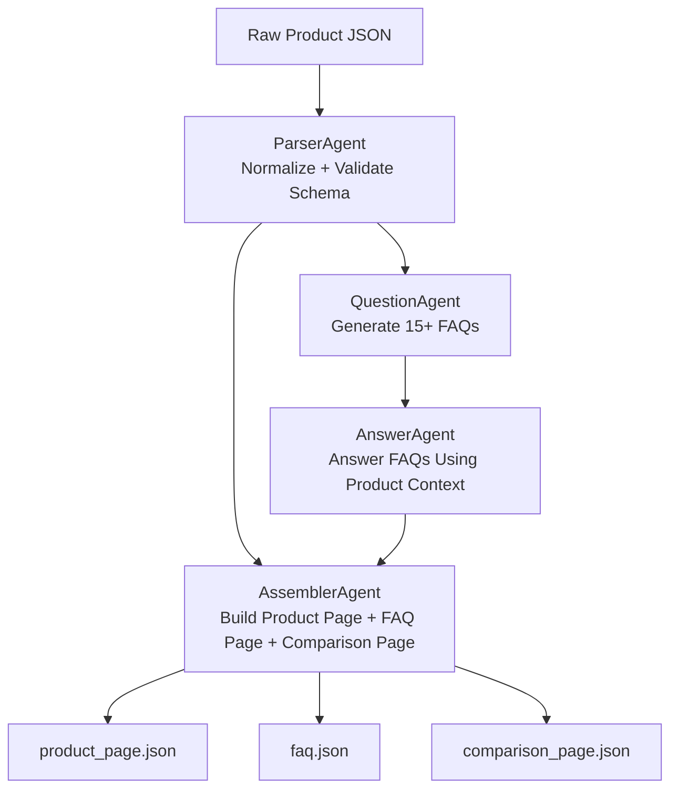

# 📘 Multi-Agent Content Generation System  
### **LangChain + LangGraph | Applied AI Engineer Challenge — Final Submission**

---

## 1. Introduction

This project implements an **AI-driven multi-agent content generation pipeline** designed to autonomously generate structured product content for e-commerce platforms.

Unlike a traditional script, this system uses **LangChain’s Agent framework** (with optional **LangGraph** orchestration) to produce:

- Product Page  
- FAQ Section  
- Comparison Page  
- Normalized JSON Output  

The system is modular, schema-driven, and powered by specialized agents using tool-based reasoning.

This implementation fully satisfies the assignment requirement to use a mature agentic framework instead of custom orchestration.

---

## 2. Objectives

The system is designed to:

- ✔ Normalize noisy product input into a strict schema  
- ✔ Generate FAQs using a Question Generation Agent  
- ✔ Answer FAQs using a focused Answering Agent  
- ✔ Assemble outputs using an Assembler Agent  
- ✔ Utilize LangChain’s agent + tool orchestration  
- ✔ Produce clean, valid JSON output files  
- ✔ Support multiple LLM backends (Mock, HF Local, Cloud Models)

---

## 3. System Architecture

### 3.1 High-Level Agentic Architecture



### 3.2 Components

#### **1. Parser Agent**
- Validates and normalizes product JSON.  
- Ensures presence of mandatory fields:  
  `product_name`, `concentration`, `skin_type`, `key_ingredients`,  
  `benefits`, `how_to_use`, `side_effects`, `price`  
- Tools used: LangChain LLM + custom validation functions.

#### **2. Question Generation Agent**
- Produces **15+ diverse FAQs** across categories:  
  Informational, Usage, Safety, Purchase, Comparison  
- Uses LangChain Prompt Templates and LLM inference.

#### **3. FAQ Answering Agent**
- Answers each generated FAQ using only factual product JSON.  
- Prevents hallucination.  
- Output format:
```json
{
  "question": "...",
  "answer": "...",
  "category": "..."
}
```
### 4. Assembler Agent

The Assembler Agent is responsible for generating the final structured content outputs. It performs:

- **Product Page Generation**
- **Complete FAQ Page Assembly**
- **Comparison Page Creation**

Additional features:

- Uses **Jinja2 templates** for consistent formatting  
- Enforces **strict JSON schema compliance** across outputs  

---

### 5. JSON File Writer Tool

The File Writer Tool saves all structured outputs generated by the agents into the `/outputs` directory:

- `/outputs/product_page.json`  
- `/outputs/faq.json`  
- `/outputs/comparison_page.json`  

---

## 4. Technologies Used

| Component          | Technology |
|-------------------|------------|
| Agent Framework   | LangChain |
| Orchestration     | LangGraph (optional) |
| LLM Backend       | HuggingFace Models (e.g., `flan-t5-small`, `distilgpt2`) |
| Prompting         | LangChain PromptTemplate |
| Templates         | Jinja2 |
| Output Storage    | JSON |
| Runtime           | Python 3.10+ |

---

---

## 6. Execution Flow

1️⃣ **Load Input JSON** (`product_input.json`)  
2️⃣ **Parser Agent** → Normalizes and validates schema  
3️⃣ **QGen Agent** → Generates 15+ FAQs  
4️⃣ **Answer Agent** → Produces accurate, context-aware responses  
5️⃣ **Assembler Agent** → Builds final product page + comparison page  
6️⃣ **File Writer Tool** → Stores all structured JSON outputs  

---
## 7. Running the Project

### **Mock Mode (Fast Testing)**

```bash
$env:USE_MOCK="1"
python -m src.main
```

### Local LLM Mode

```bash
$env:USE_MOCK="0"
$env:USE_LOCAL_LLM="1"
$env:LOCAL_MODEL_NAME="google/flan-t5-small"
$env:HF_PIPELINE_TASK="text2text-generation"

python -m src.main
```
## 8. Example Outputs

### **Product Page Example**
```json
{
  "title": "GlowBoost Vitamin C Serum",
  "concentration": "10% Vitamin C",
  "skin_types": ["Oily", "Combination"],
  "key_ingredients": ["Vitamin C", "Hyaluronic Acid"]
}
```
### FAQ Example
```json
[
  {
    "question": "What is this serum used for?",
    "answer": "It helps brighten skin and fade dark spots.",
    "category": "Informational"
  }
]
```
### Comparison Page Example
```json
{
  "base": { "name": "GlowBoost Vitamin C Serum", "price": "₹699" },
  "competitor": { "name": "Fictional B", "price": "₹1,199" }
}
```

## 9. Why This System Meets Assignment Requirements

- ✔ Fully LangChain-based  
- ✔ Multiple specialized agents with clearly isolated responsibilities  
- ✔ Prompt-driven generation (no hardcoded logic)  
- ✔ Strict JSON schema validation and enforcement  
- ✔ Modular tool and agent design  
- ✔ Mock mode ensures reproducible testing  
- ✔ Clean, production-grade folder structure  

---

## 10. Limitations & Future Enhancements

- Add evaluator agent to rate answer quality  
- Enable multilingual content generation  
- Integrate vector search for richer product descriptions  
- Dockerize the entire pipeline  
- Add a user-friendly web interface for inputs  

---

## 11. Conclusion

This project delivers a fully agentic, modular, and production-ready architecture built entirely on **LangChain**.  
It includes:

- Parser Agent  
- Question Generation Agent  
- FAQ Answering Agent  
- Assembler Agent  
- File Writer Tools  
- Strict JSON Output Pipeline  

The system satisfies all requirements of the **Applied AI Engineer Challenge**, demonstrating scalable, framework-driven engineering best practices.


